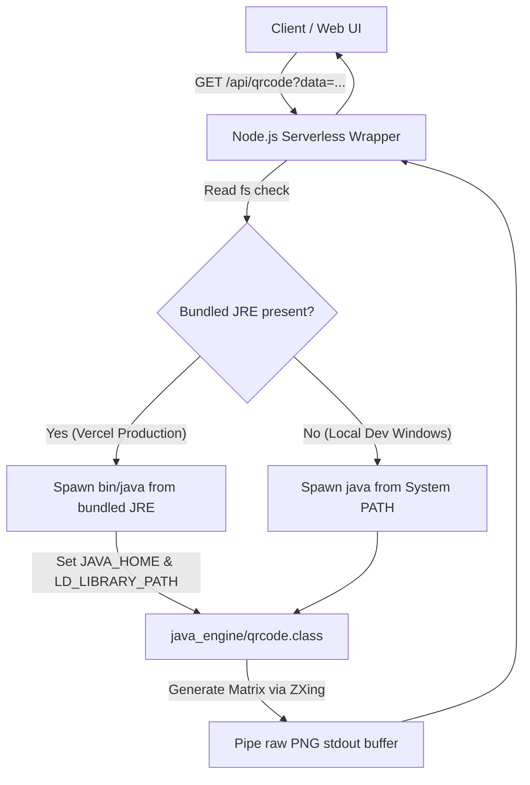

# 🏭 Dynamic QR Code & Barcode Factory

A stateless, high-performance, and edge-cacheable image generation engine built with a hybrid Node.js and Java JRE architecture. It generates custom-styled 2D QR codes and standard 1D barcodes dynamically on Vercel's serverless platform, achieving native execution speeds with optimized Edge CDN caching.

---

## 🌟 Key Features

*   **Stateless 2D/1D Generation**: Real-time generation of QR Codes and standard 1D barcodes (e.g., `CODE_128`, `EAN_13`, `UPC_A`) using Google's ZXing library.
*   **Factory-Level Styling**: Full control over dimensions, foreground color, and background color utilizing custom 32-bit ARGB hex mapping.
*   **Bundled JRE 17 Core**: Runs serverless Java child processes inside standard Vercel Lambda environments by packaging a portable Eclipse Temurin Headless JRE.
*   **Aggressive Edge CDN Caching**: Attaches `Cache-Control: public, max-age=31536000, immutable` headers for ultra-fast near-instant global delivery.
*   **Premium Verification HUD**: A gorgeous dark-mode web application featuring glassmorphic controls, HSL preset grids, and a simulated scanner HUD overlay for testing.

---

## 📐 Architecture & Pipeline



---

## 📂 Project Structure

```text
barcode-factory/
├── api/
│   ├── qrcode.js        # Node.js QR Code handler (spawns JRE & sets LD_LIBRARY_PATH)
│   └── barcode.js       # Node.js Barcode handler (spawns JRE & sets LD_LIBRARY_PATH)
├── java_engine/
│   ├── qrcode.java      # Java engine QR code logic
│   ├── barcode.java     # Java engine barcode logic
│   ├── qrcode.class     # Precompiled Java 17 bytecode
│   └── barcode.class    # Precompiled Java 17 bytecode
├── public/
│   └── index.html       # Sleek dark-mode tester interface
├── lib/                 # ZXing and Maven dependency JARs (core, javase, jcommander)
├── build.js             # Vercel build script (auto-downloads libraries and portable JRE 17)
├── pom.xml              # Maven project descriptor
├── vercel.json          # Vercel Serverless Function & routing configuration
├── package.json         # Node build and dependency descriptor
└── README.md            # Project guide
```

---

## 🛠️ Installation & Local Development

### Prerequisites
*   Node.js (v18 or higher recommended)
*   Java Development Kit (JDK 17 or higher) in your system `PATH`
*   Vercel CLI (`npm install -g vercel` or run via `npx`)

### 1. Setup the Repository
```bash
git clone <repository-url>
cd barcode-factory
npm install
```

### 2. Build and Compile
Run the build script to download the ZXing dependencies and compile the Java engines locally:
```bash
npm run build
```
*(On Windows/macOS, this compiles the Java files and skips the Linux-only JRE download. On Linux/Vercel, it downloads and strips the portable headless JRE).*

### 3. Run the Local Dev Server
Launch the Vercel local emulation server:
```bash
npx vercel dev --listen 3000
```
Open **[http://localhost:3000](http://localhost:3000)** in your browser to interact with the visual HUD.

---

## ☁️ Production Vercel Deployment

Deploying the JRE-bundled application to Vercel is completely automated:

```bash
# Link the project (first-time only)
npx vercel link

# Trigger production compilation and release
npx vercel --prod
```

### How Vercel Packaging Works:
1.  Vercel boots a Linux build container and runs `npm run build` (`node build.js`).
2.  `build.js` downloads the **Eclipse Temurin OpenJDK 17 Headless JRE for Linux x64** from Adoptium's API.
3.  The script unpacks the JRE and aggressively prunes the `/legal` subfolder to minimize size and eliminate dynamic Unix symlinks.
4.  `vercel.json` applies `includeFiles` configuration to explicitly package the precompiled `java_engine/`, dependencies `lib/`, and our portable `jre/` directly inside the deployed Lambda functions.

---

## 📡 Stateless API Specification

### 1. QR Code Generator: `GET /api/qrcode`

Generates high-density 2D QR Code image streams.

#### Query Parameters:
| Parameter | Type | Default | Description |
| :--- | :--- | :--- | :--- |
| **`data`** *(Req)* | String | *None* | Text or URL content to encode. |
| **`size`** | Integer | `200` | Width and height in pixels (range: 10 - 2000). |
| **`fg`** | Hex String | `000000` | Foreground color in RGB hex format (e.g. `6366f1` without `#`). |
| **`bg`** | Hex String | `FFFFFF` | Background color in RGB hex format. |

#### Example:
```text
GET /api/qrcode?data=HelloVercel&size=300&fg=14b8a6&bg=0a0b10
```

---

### 2. Barcode Generator: `GET /api/barcode`

Generates standard 1D linear barcode image streams.

#### Query Parameters:
| Parameter | Type | Default | Description |
| :--- | :--- | :--- | :--- |
| **`data`** *(Req)* | String | *None* | Barcode characters to encode (must fit selected symbology spec). |
| **`format`** | Enum | `CODE_128` | Symbology format: `CODE_128`, `CODE_39`, `EAN_13`, `EAN_8`, `UPC_A`, `CODABAR`, `PDF_417`. |
| **`width`** | Integer | `300` | Width in pixels (range: 10 - 3000). |
| **`height`** | Integer | `100` | Height in pixels (range: 10 - 2000). |
| **`fg`** | Hex String | `000000` | Foreground color in RGB hex format (e.g., `ffffff`). |
| **`bg`** | Hex String | `FFFFFF` | Background color in RGB hex format. |

#### Example:
```text
GET /api/barcode?data=123456789&format=CODE_128&width=400&height=120&fg=ffffff&bg=000000
```

---

### 3. Query Validation Error Payload (`400 Bad Request`)
If a required parameter is missing or color/sizes are invalid, the API returns a standard fallback JSON payload:
```json
{
  "error": "Required query parameter 'data' is missing or empty."
}
```

---

## 🔒 License & Credits

*   Built utilizing Google's **ZXing ("Zebra Crossing")** library.
*   Java JRE distributions are provided by the **Eclipse Foundation (Adoptium project)**.
